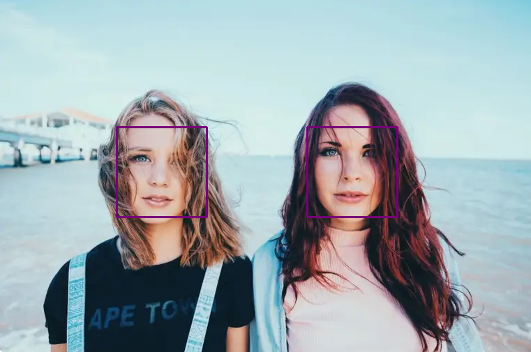

# 1. Детекция лиц в Open CV


```
        def face_det_cv2(photo_name):
        import cv2
        """
            Чтобы считать изображение в RGB — cv2.IMREAD_COLOR, в оттенках серого — cv2.IMREAD_GRAYSCALE.
        """
        img_color = cv2.imread(photo_name)
        img_gray = cv2.cvtColor(img_color, cv2.COLOR_BGR2GRAY)
        face_cascade = cv2.CascadeClassifier('haarcascade_frontalface_default.xml')


        faces = face_cascade.detectMultiScale(
            img_gray,
            scaleFactor = 1.05, # Данный параметр компенсирует перспективу ( ближе дальше лица относительно друг друга ) 
            minNeighbors= 12, # Уменьшение этого значения может помочь обнаружить больше лиц, но также увеличивает количество ложных срабатываний
            minSize=(35,35) # Этот параметр определяет минимальный размер лиц, которые будут обнаружены. 
        )

        check_len_face = len(faces)

        for(x,y,w,h) in faces:
            cv2.rectangle(img_color, (x,y), (x+w, y+h), (255,255,0), 2)

        face_profile_cascade = cv2.CascadeClassifier('haarcascade_profileface.xml')

        faces = face_profile_cascade.detectMultiScale(
            img_gray,
            scaleFactor = 1.05, # Данный параметр компенсирует перспективу ( ближе дальше лица относительно друг друга ) 
            minNeighbors= 12, # Уменьшение этого значения может помочь обнаружить больше лиц, но также увеличивает количество ложных срабатываний
            minSize=(65,65) # Этот параметр определяет минимальный размер лиц, которые будут обнаружены. 
        )

        # Отрисовка прямугольков вокруг лиц
        for(x,y,w,h) in faces:
            cv2.rectangle(img_color, (x,y), (x+w, y+h), (255,255,0), 2)
        
        faces_detected = "Лиц обнаружено :" + format(len(faces) + check_len_face)
        print(faces_detected)
        
        # plt.figure(figsize=(8,8), dpi=90)
        # plt.imshow(cv2.cvtColor(img_color, cv2.COLOR_BGR2RGB))
        # plt.show()
        cv2.imwrite('Task_one/res_{}.png'.format(photo_name), img_color)
        # cv2.waitKey(0)
```

# 2. "Детекция лиц на основе Face Recording"
    



    
```
        def face_det_fr(photo_name):
        # Библиотека
        import face_recognition
        import cv2

        image_processed = face_recognition.load_image_file(photo_name)
        face_location = face_recognition.face_locations(image_processed)
        img = cv2.imread(photo_name)
        img = cv2.cvtColor(img, cv2.COLOR_BGR2RGB)
        for(top, right, bottom, left) in (face_location):
            cv2.rectangle(img, (left, top), (right, bottom), (120,0,120), 2)
        # plt.figure(figsize=(8,8), dpi=90)
        # plt.imshow(img)
        # plt.show()
        # cv2.waitKey(0)
        cv2.imwrite('Task_two/res_{}'.format(photo_name), cv2.cvtColor(img, cv2.COLOR_BGR2RGB))
```


# 3. "Детекция лиц на основе MTCNN"


```
    def face_det_mtcnn(photo_name):
        from mtcnn import MTCNN
        import cv2

        img = cv2.imread(photo_name) 
        detector = MTCNN()

        face_list = detector.detect_faces(img)

        for face in face_list:
            box = face["box"]
            keypoints = face["keypoints"]

            x,y,w,h = box
            cv2.rectangle(img, (x,y), (x+w, y+h), (255,0,255), 2)
            
            cv2.circle(img,keypoints["left_eye"],1,(0,0,255),5)
            cv2.circle(img,keypoints["right_eye"],1,(0,0,255),5)
            cv2.circle(img,keypoints["nose"],1,(0,0,255),5)
            cv2.circle(img,keypoints["mouth_left"],1,(0,0,255),5)
            cv2.circle(img,keypoints["mouth_right"],1,(0,0,255),5)
        
        # plt.figure(figsize=(8,8), dpi=90)
        # plt.imshow(cv2.cvtColor(img, cv2.COLOR_BGR2RGB))
        # plt.show()
        # cv2.waitKey(0)
        cv2.imwrite('Task_three/res_{}'.format(photo_name), img)
```

# 4. "Применение Face Recording для детекции лиц в видео"

## Фото для детектирования 


## Результат детектирования в видео

- вопросики это косяк с кодировкой, на русском написал "Неизвестный", исправил на "Unknown"


```
    def face_det_video():
    from base64 import b64encode
    import face_recognition
    import cv2

    # mp4 = open('test_video_2.mp4', 'rb').read()
    # data_url = "data:video/mp4;base64," + b64encode(mp4).decode()

    input_video = "test_video.mp4" # Загруженное видео

    output_video = 'output.avi' # Результирующее видео

    output_video_res = (1920,1080) # Разрешение выходного видео

    "Фото-образец для распознования на видео"
    # photo_pattern = ["face_one.png","face_second.png","face_three.png"]
    photo_pattern = ["search_face_one.png","search_face_two.png","search_face_three.png"]
    known_face_encoding = []
    for pattern in photo_pattern:
        image = face_recognition.load_image_file(pattern)
        face_encoding = face_recognition.face_encodings(image)

        if face_encoding:
            known_face_encoding.append(face_encoding[0])
        else:
            print(f"Лицо не найдено на изображении: {pattern}")
            known_face_encoding.append(None)

    "Подписи лиц на видео"
    sign_photo_name = "Nigga"
    second_photo_name = "China"
    three_photo_name = "Man"

    input_movie = cv2.VideoCapture(input_video)
    lenght = int(input_movie.get(cv2.CAP_PROP_FRAME_COUNT))
    fourcc = cv2.VideoWriter_fourcc(*'XVID')
    """
    https://fourcc.org/codecs.php - полный список декодеков
    """
    output_movie = cv2.VideoWriter(output_video, fourcc, 25.0, output_video_res)

    known_face_names = [
        sign_photo_name,
        second_photo_name,
        three_photo_name
    ]

    face_locations = []
    face_encodings = []
    face_names = []
    frame_number = 0

    while True:
        # беру отельный кадр видео
        ret, frame = input_movie.read()
        frame_number += 1
        # Если кадрый кончились
        if not ret:
            print("Не удалось прочитать кадр. Завершение.")
            break
        if frame is None or frame.size == 0:
            print("Кадр пустой или невалидный.")
            continue
        # преобраываб кадлый кадр из BGR -> RGB 
        # уменьшаю до 1\4 для более быстрого процесса
        small_frame = cv2.resize(frame, (0,0), fx=1, fy=1)

        rgb_small_frame = np.ascontiguousarray(small_frame[:, :, ::-1])
        
        try:
        # Нахожу лица в кадре
            # print("Oбрабоктка кадра...{}".format(frame_number))
            face_locations = face_recognition.face_locations(rgb_small_frame)
            if len(face_locations) == 0:
                print("Лица не найдены на кадре №{}.".format(frame_number))
                continue 
            else:
                # print(f"Найденные лица : {face_locations}")
                face_encodings = face_recognition.face_encodings(rgb_small_frame, face_locations)
        except Exception as ex:
            print(f"Ошибка при обработке кадра: {ex}")
            # output_movie.write(frame)
            continue
        face_names = []

        for face_encod in face_encodings:

            # Проверка если ли целевое лицо среди найденных
            match = face_recognition.compare_faces(known_face_encoding, face_encod, tolerance=0.50)

            name = "Unknown"

            face_distances = face_recognition.face_distance(known_face_encoding, face_encod)
            best_match_index = np.argmin(face_distances)
            if match[best_match_index]:# Если найдено целевое лицо, то присваиваем нужное имя
                name = known_face_names[best_match_index]
            face_names.append(name)

        # Подписываем результат
        for (top, right, bottom, left), name in zip(face_locations, face_names):
            
            if not name:
                print("Имени не найдено в кадре {}".format(frame_number))
                continue
            # Обвожу рамкой лицо
            cv2.rectangle(frame, (left, top), (right, bottom), (0, 255, 0), 2) 

            # Рисую квадрат с подписью имени
            cv2.rectangle(frame, (left, bottom - 25), (right, bottom), (0, 255, 0), cv2.FILLED)
            font = cv2.FONT_HERSHEY_DUPLEX
            cv2.putText(frame, name, (left + 6, bottom - 6), font, 0.5, (0, 0, 0), 1)

        print("Writing frame {} / {}".format(frame_number, lenght))
        output_movie.write(frame)
    """
        *функция out.release() используется для освобождения ресурсов, связанных с объектом VideoWriter
        
        *cv2.destroyAllWindows() в библиотеке OpenCV используется для закрытия всех окон, 
            созданных с помощью функций OpenCV, таких как cv2.imshow()
    """
    output_movie.release()
    cv2.destroyAllWindows()
```
