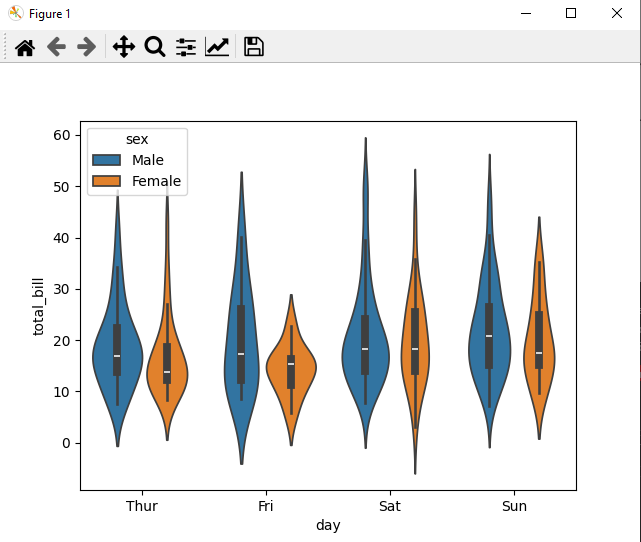
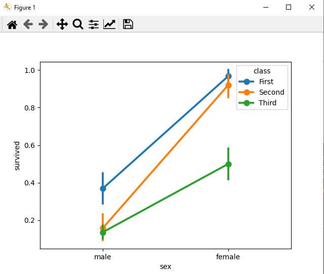
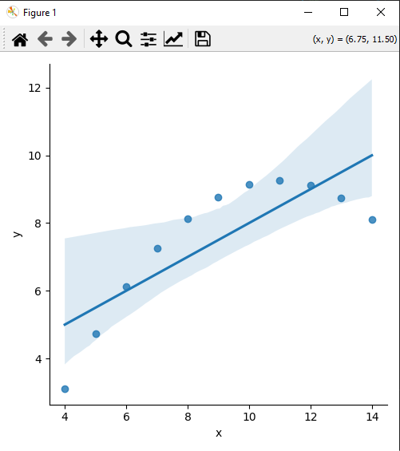

# Шпаргалка по SEABORN
### Библиотека Seaborn поставляется с несколькими важными
наборами данных. Если Seaborn доступен, наборы данных
загружаются автоматически. Вы можете использовать любой из этих
наборов данных для обучения. С помощью следующей функции вы
можете загрузить необходимый набор данных из 18, доступных в
Seaborn: **load_dataset().**
Чтобы просмотреть все доступные наборы данных в библиотеке
Seaborn, вы можете использовать следующую команду с функцией
**get_dataset_names(): sb.get_dataset_names().**

```
Импорт набора данных 'tips' – чаевые
df = sb.load_dataset('tips')
df.head()
```

DataFrame хранит данные в форме прямоугольных сеток, с помощью
которых можно легко просматривать данные. Каждая строка
прямоугольной сетки содержит значения экземпляра, а каждый
столбец сетки представляет собой вектор, который содержит данные
для определенной переменной. Это означает, что строки DataFrame
не обязательно должны содержать значения одного и того же типа
данных, они могут быть числовыми, символьными, логическими и т.д.
DataFrames для Python поставляются с библиотекой Pandas и
определяются как двумерные структуры данных с потенциально
разными типами столбцов

## Визуализация в Seaborn: представление данных эффективным и простым способом

Библиотека Matplotlib отлично поддерживает настройку графиков и
рисунков, но для ее использования необходимо знать, какие
параметры нужно настроить для получения привлекательного и
желаемого изображения. В отличие от Matplotlib, Seaborn
поставляется с настроенными функциями и высокоуровневым
интерфейсом для настройки и управления внешним видом фигур
Matplotlib.

- по умолчанию в
Seaborn, используя функцию set()
```
def sinplot(flip = 1):
x = np.linspace(0, 14, 100)
 for i in range(1, 5):
plt.plot(x, np.sin(x + i*.5)*(7 - i)*flip)
sb.set()
sinplot()
plt.show()
```
#### По сути, Seaborn разбивает параметры Matplotlib на две группы:
- Стили фона
- Масштаб рисунка

## Seaborn Figure Styles
Интерфейсом для манипулирования стилями является
set_style(). С помощью этой функции вы можете установить
«стиль» фона. Ниже представлены пять доступных «стилей»:
- "darkgrid" – темный фон, белая сетка
- "whitegrid" – белый фон, темная сетка
- "dark" – темный фон
- "white" – белый фон
- "ticks" – белый фон, обрамление рисунка

```
def sinplot(flip=1):
 x = np.linspace(0, 14, 100)
 for i in range(1, 5):
 plt.plot(x, np.sin(x + i*.5)*(7 - i)*flip)
sb.set_style("whitegrid")
sinplot()
plt.show()
```

#### Удаление осей сетки
В стилях "white" и "ticks" мы можем удалить верхнюю и правую
оси (границы рисунка), используя функцию despine() (что не
поддерживается в Matplotlib).
```
    def sinplot(flip=1):
    x = np.linspace(0, 14, 100)
    for i in range(1, 5):
    plt.plot(x, np.sin(x + i*.5)*(7 - i)*flip)
    sb.set_style("white")
    sinplot()
    sb.despine()
    6
    plt.show()
```
###  Переопределение элементов
Если вы хотите настроить стили Seaborn, вы можете
воспользоваться словарем параметров функции set_style().
Доступные параметры просматриваются с помощью функции
axes_style().
```
sb.axes_style()
```
- Изменение значений любого параметра изменит стиль графика
```
def sinplot(flip=1):
 x = np.linspace(0, 14, 100)
 for i in range(1, 5):
 plt.plot(x, np.sin(x + i * .5) * (7 - i) * flip)
sb.set_style("darkgrid", {'axes.axisbelow': False}) # Изменили здесь
sinplot()
sb.despine()
plt.show()
```

## Цветовая палитра Seaborn

Цвет играет важную роль, чем любой другой аспект визуализации.
Seaborn предоставляет функцию color_palette(), которую можно
использовать для придания цвета графикам и для большего
эстетического вида.
- Синтаксис функции
```
seaborn.color_palette (palette = None, n_colors = None, desat = None)
```
### Параметры для построения цветовой палитры:
- n_colors – количество цветов в палитре.
Если None, значение по умолчанию будет зависеть от того, как
указана палитра.
- Desat – пропорция для варьирования каждого цвета.

Доступные палитры Seaborn:
- глубокий
- приглушенный
- яркий
- пастельный
- темный

### Иногда трудно решить, какую палитру следует использовать для
данного набора данных, не зная характеристик данных. Приведем
различные способы использования типов color_palette():
- качественные палитры
- последовательные палитры
- расходящаяся палитра

Есть и другая функция **seaborn.palplot()**, которая работает с
цветовой палитрой. Эта функция отображает цветовую палитру как
горизонтальный массив. Узнаем больше о seaborn.palplot () из
следующих примеров.

### Качественные цветовые палитры
Качественные или категориальные палитры лучше всего подходят
для построения категориальных данных.
```
current_palette = sb.color_palette()
sb.palplot(current_palette)
plt.show()
```

- Вы можете увидеть желаемое количество цветов,
передав значение в параметр n_colors. Здесь palplot() используется
для горизонтального построения массива цветов.

### Последовательные цветовые палитры
Последовательные палитры подходят для отображения
распределения данных в диапазоне от относительно более низких
значений до более высоких значений в пределах диапазона.
При добавлении дополнительного символа **‘s’** к цвету, переданному
параметру цвета, будет построен график «Последовательная
палитра».
```
current_palette = sb.color_palette()
sb.palplot(sb.color_palette("Greens"))
plt.show()
```


### Расходящаяся палитра

Расходящиеся палитры используют два разных цвета. Каждый цвет
представляет изменение значения в пределах от общей точки в
любом направлении.
Предположим, что данные располагаются в диапазоне от -1 до 1.
Значения от -1 до 0 принимают один цвет, а от 0 до +1 – другой цвет.
По умолчанию значения центрированы от нуля. Вы можете управлять
ими с помощью параметра center, передавая значение.

```
current_palette = sb.color_palette()
sb.palplot(sb.color_palette("BrBG", 7))
plt.show()
```


### Настройка цветовой палитры по умолчанию
У функций color_palette() есть сопутствующий элемент set_palette().
Аргументы одинаковы как для set_palette(), так и для color_palette().
Параметры Matplotlib по умолчанию настроены так, что палитра
используется для всех графиков.
```
def sinplot(flip = 1):
 x = np.linspace(0, 14, 100)
 for i in range(1, 5):
 plt.plot(x, np.sin(x + i * .5) * (7 - i)*flip)
sb.set_style("white")
sb.set_palette("husl")
sinplot()
plt.show()
```

## Пройдемся по основным видам графиков

### Построение одномерного распределения
Распределение данных – это главное, что нужно знать при анализе
данных. Здесь мы увидим, как seaborn помогает в понимании
одномерного распределения данных.
```
Набор данных 'чаевые'
tips = sb.load_dataset('tips')
ax = sb.scatterplot(x = 'total_bill', y='tip', data = tips)
plt.show()
```

###  Гистограмма

Гистограмма является наиболее распространенным инструментом
для изучения распределения данных. В типичной гистограмме мы
сопоставляем числовую переменную с осью x. В конечном итоге гистограмма содержит группу
столбцов, которые показывают «высоту» данных (то есть количество
данных) для различных значений нашей числовой переменной.
Гистограмма показывает нам, как распределяется переменная.

### График плотности

другой основной инструмент для оценки
распределения данных. Один из наиболее распространенных методов
построения графиков называется «оценка плотности ядра». График,
который мы создаем при использовании оценки ядерной плотности,
называется «графиком ядерной оценки плотности». Они также известны
как «графики KDE».
Графики KDE (то есть графики плотности) очень похожи на
гистограммы с точки зрения того, как мы их используем. Мы используем
графики плотности, чтобы оценить, как распределяется числовая
переменная.
Основное отличие состоит в том, что графики KDE используют
плавную линию для отображения распределения, тогда как
гистограммы используют столбики. Итак, графики KDE показывают
плотность, тогда как гистограммы показывают количество.

#### Seaborn имеет две разные функции для визуализации одномерного распределения данных – seaborn.kdeplot() и seaborn.distplot(). Будем использовать распространенное соглашение о вызове функций: sb.distplot() и sb.kdeplot().

- <span style="background-color: red;">**Функция distplot()**</span> предоставляет наиболее удобный способ
быстро взглянуть на одномерное распределение. Эта функция строит
комбинированный рисунок, который содержит гистограмму и график
оценки плотности ядра данных.

#### Параметры функции **sb.distplot()**:
- color – меняет цвет графика KDE и гистограммы;
- kde – включает и выключает график KDE в выводе. Этот параметр принимает в качестве аргумента логическое значение
(True или False). По умолчанию для параметра kde установлено
значение kde = True.
- hist – определяет, будет ли гистограмма отображаться на выходе.
По умолчанию установлено значение hist = True, что означает, что
по умолчанию выходной график будет включать гистограмму входной
переменной. Если вы установите hist = False, функция удалит
гистограмму из вывода.
- bins – отвечает за количество интервалов в выходной гистограмме.
Если вы не установите значение для параметра bins, функция
автоматически вычислит соответствующее количество интервалов.

```
df = sb.load_dataset('iris')
sb.distplot(df['petal_length'],kde = False)
plt.show()
```


## Построение двумерного распределения

Двумерное распределение используется для определения связи между
двумя переменными. Это в основном касается отношений между двумя
переменными и того, как одна переменная ведет себя по отношению к
другой.
Лучший способ проанализировать двумерное распределение –
использовать <span style="background-color: red;">**Функцию jointplot()**</span> 

- <span style="background-color: red;">**Jointplot**</span> создает многопанельную фигуру, которая проецирует
двумерные отношения между двумя переменными, а также одномерное
распределение каждой переменной по отдельным осям.
- <span style="background-color: red;">**Scatter Plot**</span>  диаграмма рассеяния является наиболее удобным
способом визуализации распределения, в котором каждое наблюдение представлено в двухмерном графике через оси x и y.

```
df = sb.load_dataset('iris')
sb.jointplot(x = 'petal_length', y = 'petal_width', data = df)
plt.show()
```


### Визуализация парных отношений

Наборы данных, как правило, содержат много переменных. В таких
случаях анализируют отношение между каждыми переменными.
Построение двумерного распределения на практике для всех
комбинаций переменных – очень сложный и длительный процесс.
Чтобы построить несколько попарных двумерных распределений в
наборе данных, можно использовать <span style="background-color: red;">**функцию pairplot()**</span>

**Синтаксис функции pairplot()**
```
seaborn.pairplot(data,…)
```
**параметры:**
- data – dataframe;
- hue – переменная для отображения разных категорий данных разными
цветами;
- palette – набор цветов для отображения переменной;
- diag_kind – тип графика для диагонального расположения;
- kind – тип графика для внедиагонального расположения
**Значения которые могут принимать diag_kind и kind – {'scatter',
'reg', 'hist', 'kde'}.**
```
df = sb.load_dataset('iris')
sb.set_style("ticks")
sb.pairplot(df, hue = 'species', diag_kind = "kde", kind = "scat
ter", palette = "husl")
plt.show()
```

Диагональные графики представляют собой графики плотности ядра,
другие графики представляют собой графики рассеяния.

### Категориальные точечные диаграммы

Когда одна или обе исследуемые переменные являются
категориальными, необходимо использовать графики stripplot(),
swarmplot() и т.д.

stripplot() используется, когда одна из изучаемых переменных
является категориальной. Он представляет данные в отсортированном
порядке по любой из осей.

```
df = sb.load_dataset('iris')
sb.stripplot(x = "species", y = "petal_length", data = df, jitte
r = False)
plt.show()
```

- На полученном графике ясно видно разницу в длине лепестка у
каждого вида. Но главная проблема с полученным графиком рассеяния
состоит в том, что точки на графике рассеяния перекрываются.
Для обработки такого сценария можно используем параметр «jitter».

<span style="background-color: red;">**jitter – параметр, который будет регулировать позиции точек вдоль
категориальной оси.**</span>

```
df = sb.load_dataset('iris')
sb.stripplot(x = "species", y = "petal_length", data = df, jitte
r = True)
plt.show()
```

- На полученном рисунке распределение точек видно лучше.

#### Swarmplot ()

Другой вариант, который можно использовать в качестве альтернативы
jitter, – это функция **swarmplot()**, которая позиционирует каждую
точку графика рассеяния на категориальной оси и таким образом
избегает перекрывающихся точек.
```
df = sb.load_dataset('iris')
sb.swarmplot(x = "species", y = "petal_length", data = df)
plt.show()
```


##  Графики для статистических распределений
В seaborn построение гистограмм реализуется функцией barplot():
```
df = sb.load_dataset('iris')
sb. barplot(x = "species", y = "petal_length", data = df)
plt.show()
```


#### Коробка с усами
**Boxplot** - это удобный способ визуализации распределения данных по
квартилям.

Коробчатые диаграммы обычно имеют вертикальные линии, идущие от
коробок, которые называются усами. Эти усы указывают на
изменчивость за пределами верхнего и нижнего квартилей, поэтому
график boxplot также называются диаграммой «коробка с усами».
Любые выбросы в данных представлены в виде отдельных точек.

```
df = sb.load_dataset('iris')
sb. boxplot(x = "species", y = "petal_length", data = df)
plt.show()
```

- **Примечание** Полоса посередине каждой коробки – это медиана. Усы,
исходящие из каждой коробки, указывают доверительный интервал.
Точки на графике указывают на выброс.

#### Сюжеты для скрипки

Графики для скрипки представляют собой комбинацию области,
похожей на скрипку, с оценками плотности ядра. Таким образом, эти
графики легко анализировать и понимать распределение данных.
Давайте воспользуемся параметром total_bill набора данных tips.
Этот набор данных содержит информацию, касающуюся клиентов в
ресторане.

```
df = sb.load_dataset('tips')
sb.violinplot(x = "day", y = "total_bill", data=df)
plt.show()
```

- **Примечание** Значения квартилей и усов из коробочного графика
показаны внутри скрипки. Поскольку в скрипке используется KDE, более
широкая часть скрипки указывает на более высокую плотность, а узкая
область представляет относительно более низкую плотность.
Межквартильный диапазон в коробчатом графике и более высокая
плотность в kde попадают в одну и ту же область каждой категории
скрипичного сюжета.

На полученном графике показано распределение total_bill по
четырем дням недели. Если мы хотим увидеть, как параметр
total_bill ведет себя по отношению к полу, давайте рассмотрим его
в следующем примере.
```
df = sb.load_dataset('tips')
sb.violinplot(x = "day", y = "total_bill", hue = 'sex', data = df)
plt.show()
```


- В большинстве ситуаций мы имеем дело с оценками всего
распределения данных. Для оценки центральной тенденции нам нужен
конкретный способ анализа распределения. Среднее значение и
медиана являются часто используемыми методами для оценки
центральной тенденции распределения.

#### Barplot()
гистограмма представляет собой оценку центральной
тенденции. Для анализа будем использовать набор данных «Титаник».

```
df = sb.load_dataset('titanic')
sb.barplot(x = "sex", y = "survived", hue = "class", data = df)
plt.show()
```
- Построим гистограмму среднего числа выживших мужчин и
женщин в каждом классе кают.


- Гистограмма позволяет оценить количество наблюдений в каждой
категории. Для этого можно использовать функцию countplot().
```
df = sb.load_dataset('titanic')
sb.countplot(x = "class", data = df, palette = "Blues")
plt.show()
```


#### Графики с точками

Графики с точками служат той же цели, что и столбчатые. Вместо
столбика значение оценки представляется точкой на определенной
высоте оси.

```
df = sb.load_dataset('titanic')
sb.pointplot(x = "sex", y = "survived", hue = "class", data = df)
plt.show()
```



## Функции для изображения моделей линейной регрессии

В большинстве случаев мы используем наборы данных, которые
содержат несколько количественных переменных, и цель анализа часто
состоит в том, чтобы связать эти переменные друг с другом. Это можно
сделать через линии регрессии.

При построении регрессионных моделей мы часто проверяем
мультиколлинеарность, т.е. видеть корреляция между всеми
комбинациями непрерывных переменных, и предпринимаем
необходимые действия для удаления мультиколлинеарности, если она
существует.

В Seaborn есть две основные функции для визуализации линейных
отношений, определенных посредством регрессии. Этими функциями
являются **regplot() и lmplot()**.

Функция **regplot()** принимает переменные x и y в различных форматах,
включая простые числовые массивы, объекты серии pandas или как
ссылки на переменные в DataFrame pandas.

У функции **lmplot** параметр data выступает в качестве обязательного,
а переменные x и y должны быть указаны в виде строк. Такой формат
данных называется «длинные данные».

#### Построим regplot и затем lmplot по одним и тем же данным
```
df = sb.load_dataset('tips')
sb.regplot(x = "total_bill", y = "tip", data = df)
sb.lmplot(x = "total_bill", y = "tip", data = df)
plt.show()
```


#### Построим линейную регрессию, когда одна из переменных принимает дискретные значения
```
df = sb.load_dataset('tips')
sb.lmplot(x = "size", y = "tip", data = df)
plt.show()
```


Для некоторых «хороших» данных модель линейной регрессии
подбирается достаточно просто и хорошо описывает тенденцию в
данных. Но в большинстве случаев данные являются нелинейными, и
подбор хорошей модели линии регрессии является нетривиальной
задачей.

В следующих примерах будем использовать набор данных anscombe
для построения графиков регрессии.

```
df = sb.load_dataset('anscombe')
sb.lmplot(x="x", y="y", data=df.query("dataset == 'I'"))
plt.show()
```


```
df = sb.load_dataset('anscombe')
sb.lmplot(x = "x", y = "y", data = df.query("dataset == 'II'"))
plt.show()
```




